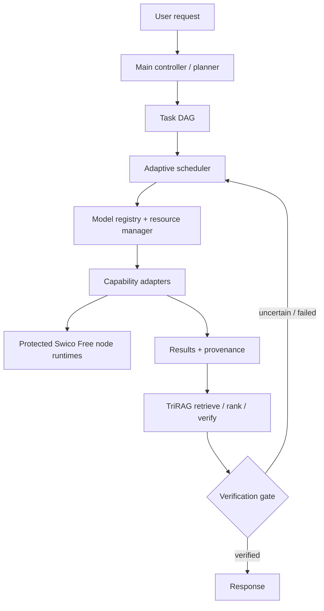

# Swico Adaptive Multi-Model Orchestration

The original `app.py`, Qwen runtime, E5 runtime, authentication, bounded queues,
timeouts, cancellation, localhost-only binding, health endpoint, and benchmark
scripts remain the inference execution layer. The `orchestrator/` package sits
above that layer and is deliberately in-process for low-resource deployments.

The eight user-facing capability groups are chat, coding, image generation,
speech-to-text, text-to-speech, video generation, document creation, and
document analysis. Retrieval is an internal grounding service, not a ninth
mini-model group.

## Selected model integration status

The exact selected models are registered with configuration-driven paths, but no
weights are present in this workspace. Real mode therefore reports
NOT_INSTALLED and uses unavailable specialized adapters rather than substituting
the parent Qwen runtime. Explicit mock mode reports MOCK and is used for tests.

| Capability | Selected model | Runtime boundary | Current status |
|---|---|---|---|
| Chat | Qwen3-0.6B | shared-compatible Qwen adapter | NOT_INSTALLED / MOCK |
| Coding | Qwen2.5-Coder-0.5B-Instruct | Qwen adapter boundary | NOT_INSTALLED / MOCK |
| Image generation | MobileDiffusion | image adapter | NOT_INSTALLED / MOCK |
| Video generation | Wan2.1 T2V-1.3B | long-running video adapter | NOT_INSTALLED / MOCK |
| STT | Whisper-base | speech adapter | NOT_INSTALLED / MOCK |
| TTS | Kokoro-82M | speech adapter | NOT_INSTALLED / MOCK |
| Document creation | SmolLM2-360M-Instruct | structured-spec adapter | NOT_INSTALLED / MOCK |
| Document analysis | SmolDocling-256M | document adapter | NOT_INSTALLED / MOCK |

No model URLs, weights, quantization, RAM, or GPU measurements are fabricated.
The model path variables are listed in `.env.example`. Document creation stops at
a structured specification boundary; PDF/DOCX/PPTX/XLSX renderers are interfaces,
not implicit LLM-controlled binary writers.

## Flow



`ModelRegistry` and `CapabilityRegistry` are configuration-driven. The default
profiles are placeholders because the ZIP contains no mini-model weights. Coding,
document analysis, and document creation use the existing Qwen runtime when the
node is running; other capabilities use safe mock adapters until real adapters
and model paths are configured.

## API additions

All new routes use the existing bearer-token dependency:

- `POST /v1/orchestrate` — plan, schedule, execute, aggregate, and optionally verify.
- `GET /v1/models`, `/v1/models/health`, `/v1/capabilities` — registry introspection.
- `POST /v1/retrieval/index`, `POST /v1/retrieval/search`, `DELETE /v1/retrieval/documents/{document_id}` — authenticated local retrieval.
- `POST /v1/chat`, `GET /v1/chat/{conversation_id}`, `DELETE /v1/chat/{conversation_id}` — authenticated bounded chat sessions; `stream: true` returns SSE.

The existing `/health`, `/v1/embed`, `/v1/generate`, and `/v1/generate/stream`
routes are unchanged. No benchmark numbers are claimed here; use the supplied
benchmark/capacity scripts after installing the node's runtime dependencies.

## Evidence retrieval

E5EmbeddingAdapter wraps the already-created parent-node E5Runtime; it never
loads a second embedding model. DeterministicChunker preserves document and
chunk provenance, while LocalVectorIndex validates the required 384 dimension
and replaces duplicate document IDs. Retriever batches passage embeddings and
embeds each query once. TriRAG validates/ranks retrieved evidence, reports
conflicts, creates a structured evidence package, and evaluates supplied model
claims as supported, contradicted, or uncertain. Missing evidence is uncertain,
not verified. In mock mode, API responses identify mode: mock.

## Real installation checkpoint (2026-09-07)

The isolated runtime was created at `D:\Swico\venv` with caches redirected to
`D:\Swico\cache`. CPU-only PyTorch 2.14.0, Transformers 4.57.6, Accelerate
1.14.0, Safetensors 0.8.0, SentencePiece 0.2.2, and the existing FastAPI/audio
dependencies are installed there.

Qwen3-0.6B was the first authorized download and is stored at
`D:\Swico\models\chat-qwen3-0.6b`. The verified weight file is 1,503,300,328
bytes with SHA-256
`F47F71177F32BCD101B7573EC9171E6A57F4F4D31148D38E382306F42996874B`.
Its config identifies `model_type=qwen3`, `hidden_size=1024`, and 28 layers.

Inference validation was stopped before loading because the machine had only
0.98 GB available RAM while the weight file alone is approximately 1.50 GB.
No other approved model was downloaded, and no excluded model directory exists
under `D:\Swico\models`. Chat, coding, STT, and TTS therefore remain
NOT_VALIDATED/NOT_READY until additional memory is available.

## Qwen3 real-runtime follow-up (2026-09-07)

The original safetensors checkpoint was preserved. The official Qwen artifact
`Qwen/Qwen3-0.6B-GGUF/Qwen3-0.6B-Q8_0.gguf` was downloaded to
`D:\Swico\models\chat-qwen3-0.6b\Qwen3-0.6B-Q8_0.gguf` and verified at
639,446,688 bytes with SHA-256
`9465E63A22ADD5354D9BB4B99E90117043C7124007664907259BD16D043BB031`.
The file header is `GGUF`, architecture metadata is `qwen3`, and the official
repository identifies it as quantized from `Qwen/Qwen3-0.6B`.

The D: virtual environment now contains the prebuilt CPU-only
`llama-cpp-python 0.3.35` wheel. A standalone smoke test loaded the GGUF with
`n_ctx=1024`, `n_threads=2`, and `n_batch=16`, then generated the expected
response with a 32-token cap. The same runtime was then exercised through
`ChatModelAdapter` and `Orchestrator`; the selected chat profile is `READY`,
while coding and all specialized profiles remain unavailable.

Measured during validation: total RAM was 8,446,885,888 bytes; available RAM
was 1,686,241,280 bytes before the second smoke test, 1,510,207,488 bytes
after model load, and 874,926,080 bytes during generation. The isolated
process released the model and available RAM returned to 1,682,243,584 bytes.
The node remains CPU-only and uses the conservative 1,024-token context by
default. No excluded model was downloaded or modified.

## Resource and lifecycle hardening (2026-09-08)

The scheduler now has one authoritative `ResourceManager`. Admission happens
before adapter loading and reserves estimated RAM and CPU atomically, so two
requests cannot both consume the same budget. The default policy is one
heavyweight model resident (`SWICO_MAX_HEAVY_MODELS_RESIDENT=1`) and a 768 MB
configured minimum free-RAM margin (`SWICO_MIN_FREE_RAM_MB=768`). On the real
machine, available RAM is read from `psutil`; deterministic tests may provide a
fixed synthetic budget. Resource polling and the model idle policy are
configured by `SWICO_RESOURCE_POLL_INTERVAL_MS` and
`SWICO_MODEL_IDLE_TIMEOUT_SEC`.

Model adapters expose explicit lifecycle states: `NOT_INSTALLED`, `INSTALLED`,
`LOADING`, `READY`, `LOADED`, `EXECUTING`, `UNLOADING`, `EVICTED`,
`LOAD_FAILED`, and `UNHEALTHY`. On-demand work reserves resources, loads one
model, executes, then unloads and releases the reservation in a `finally` path.
This provides safe model switching and prevents duplicate runtime residency.
Queued work retains its task identity, priority, deadline, and cancellation
event while it waits. Interactive priority remains higher than background work
at model selection; physical execution is still serialized by resource
admission. Timeout, cancellation, runtime failure, load failure, and rejected
admission all release reservations and scheduler state. Runtime cancellation
is cooperative: the scheduler signals the adapter, but a runtime that cannot
interrupt native inference immediately cannot honestly promise mid-inference
preemption.

Resource profiles distinguish `estimated_ram_mb` (the admission requirement)
from `measured_ram_mb` (an observation). Preserved measured values are Qwen3
862 MB, Qwen2.5-Coder 545 MB, Whisper-base 340 MB, and Kokoro 562 MB peak
process RSS. E5 remains parent-process resident, but its exact footprint is
NOT MEASURED and is not fabricated. Kokoro's admission estimate is configured
to 1,400 MB because its prior isolated load reduced available RAM to
approximately 78.8 MB; therefore the scheduler rejects or queues it before
loading under the current budget. No Kokoro synthesis is performed in this
phase.

Model health now reports lifecycle state, loaded status, resource profile,
queue length, active task count, available RAM, reservations, and the
configured heavy-model limit through the existing `/v1/models/health` route.
REAL mode continues to use unavailable adapters for uninstalled models and
never silently changes them to MOCK; MOCK behavior requires
`SWICO_FREE_MOCK_MODE=true`.

## E5 profiling and real-resource validation (2026-09-08)

The E5 runtime implementation was inspected. In real application mode,
`E5Runtime` is constructed during FastAPI startup, loads one local tokenizer
and one local Transformers model, remains resident for embedding, retrieval,
and TriRAG, and has no safe runtime unload API. It uses the configured
`SWICO_FREE_E5_THREADS` value (currently 2), truncates inputs at 512 tokens,
and produces normalized 384-dimensional vectors.

E5 resource measurement is **NOT MEASURED** in this phase because no local E5
artifact exists under `D:\Swico\models` or the configured example path. A
real E5 load or embedding would require downloading a model, which is outside
this phase. No E5 model was downloaded and no second E5 runtime was created.

The baseline observation on 2026-09-08 at 12:35:42 -0500 was:

| Metric | Value | Classification |
|---|---:|---|
| Total RAM | 8,446,885,888 bytes | MEASURED |
| Available RAM | 1,319,092,224 bytes | MEASURED |
| Used RAM | 7,127,887,872 bytes | MEASURED |
| Process RSS | 16,580,608 bytes | MEASURED |
| CPU utilization | 58.5% | MEASURED |
| C: free space | 4,525,584,384 bytes | MEASURED |
| D: free space | 81,925,144,576 bytes | MEASURED |

The `ResourceManager` now exposes `resident_ram_mb` and
`resident_components`. The application identifies real-mode E5 as resident,
but leaves its cost at **NOT MEASURED / 0 configured MB** rather than
fabricating a footprint. Once a real E5 measurement is available, that value
can be supplied to admission as resident infrastructure cost. The scheduler
formula is:

`available RAM >= resident infrastructure + active reservations + model estimate + configured safety margin`

Using the current observed baseline only as a deterministic admission check,
Qwen3 and Kokoro are rejected by the 768 MB margin, while the smaller Coder
and Whisper estimates are candidates subject to live RAM fluctuation. This is
an admission result, not a real model load or switching benchmark. Qwen3 + E5,
Qwen3-to-Coder, and Coder-to-Whisper real switching were not forced because
E5 is unavailable locally and current available RAM is insufficient to safely
load Qwen3. The 768 MB threshold is therefore **NOT DETERMINABLE as a full
workload guarantee**; it is retained as the configured conservative policy and
requires additional real-world validation when a permitted local E5 artifact
is available.

## Qwen3 baseline and storage audit (2026-09-07)

Sequential baseline settings were 2 threads, context 1,024, batch 16, and
short generations capped at 24 tokens. Load time was 1.7928 seconds. Available
RAM was 1,776,615,424 bytes before load and 1,576,751,104 bytes immediately
after load. Across the controlled tests, peak process RSS was 862,015,488
bytes; minimum observed available RAM was 977,002,496 bytes. CPU utilization
was measured between 50.10% and 63.36% average, with 100% peaks. Short
non-streaming generation latency ranged from 0.9716 to 1.3769 seconds, with
9.243 to 10.770 output tokens/second. Streaming produced its first token in
0.4856 seconds and generated 7.184 output tokens/second. Prompt-processing
time was not reported by this runtime path. Unload took 0.1511 seconds and
available RAM rose to 2,228,293,632 bytes.

The six sequential checks covered short conversation, factual, coding,
streaming, cancellation, and a second request. Streaming cancellation was
confirmed after the first emitted chunk. Non-streaming cancellation did not
interrupt a call that had already completed before return; this remains a
runtime limitation rather than a fabricated success.

Pytest 9.1.1 was installed in `D:\Swico\venv`; the corrected test invocation
with `PYTHONPATH=swico_free_node` passed 12 tests, with 0 failures, 0 skips,
and 0 collection errors. The first root-level invocation produced four import
collection errors because that path was omitted; it was corrected without
changing tests.

The project scripts now default the venv, pip, Hugging Face, Transformers,
Torch, and temporary directories to `D:\Swico`. The audit found no pip, Torch,
Transformers, or Swico application cache in their usual C: locations. A
pre-existing general Hugging Face cache at
`C:\Users\MSD\.cache\huggingface` occupies approximately 5,656,604,543 bytes
and contains unrelated/mixed historical model caches; it was not deleted.
The active Swico cache is on D: and occupies approximately 186,047,165 bytes.

API regression in explicit mock mode passed authentication, health, model and
capability introspection, chat, generation, streaming generation, 384-D
embedding, retrieval index/search/delete, orchestrator execution, and verified
TriRAG output. The real Qwen adapter remains READY; E5-backed real startup was
not claimed because no additional E5 artifact was installed in this task.

## Qwen2.5-Coder real-runtime checkpoint (2026-09-07)

The exact requested model is `Qwen/Qwen2.5-Coder-0.5B-Instruct`. The official
Qwen GGUF repository was used; its metadata identifies the exact base model and
architecture. The selected file is the official Q4_K_M representation:
`qwen2.5-coder-0.5b-instruct-q4_k_m.gguf`, stored at
`D:\Swico\models\coding-qwen2.5-coder-0.5b\qwen2.5-coder-0.5b-instruct-q4_k_m.gguf`.
It is GGUF, Q4_K_M, approximately 0.5B parameters, 491,400,064 bytes, with
SHA-256
`1D9614638D18024D0FBB36575A15F1302A3ADF044DF10345688EC4F6E1C4FF32`.

No new inference runtime was needed: the existing CPU-only
`llama-cpp-python 0.3.35` runtime loaded the model successfully. The controlled
coding benchmark used 2 threads, context 1,024, batch 16, one sequential
request at a time, and short output caps. The first benchmark load took 3.9434
seconds, with 1,486,643,200 bytes available before load and 1,329,127,424
bytes after load. Across the coding tests, peak process RSS was 544,550,912
bytes and minimum available RAM was 937,533,440 bytes. Average CPU utilization
ranged from 52.33% to 71.10%, with 100% peaks. Generation latency ranged from
1.2259 to 1.6490 seconds, with measured throughput from 12.214 to 26.103
tokens/second. Streaming first-token time was 0.2697 seconds. Prompt
processing time was not measured by this runtime path.

The coding test matrix passed real inference for a factorial function, a Python
debugging correction, a code explanation, streaming, and streaming
cancellation. The factorial routing test selected only
`coding-qwen2.5-coder-0.5b` through `CodingModelAdapter`; it did not execute on
Qwen3. The coding registry profile is `READY` when a coding runtime is supplied
to `Orchestrator.with_defaults(coding_runtime=...)`.

A separate clean lifecycle measurement loaded the coding model in 1.1347
seconds, then unloaded it in 0.5687 seconds. Available RAM changed from
1,511,755,776 bytes before load to 1,342,128,128 bytes after load and
1,452,142,592 bytes after unload; process RSS after unload was 43,393,024
bytes. Qwen3 was not loaded during any coding benchmark, and no coexistence
test was attempted because the measured headroom is insufficient to justify
simultaneous residency.

The application keeps Qwen3 as the normal chat runtime and does not
automatically load both models. Coding runtime activation is explicit and
separate so coding requests cannot silently fall back to Qwen3. A future
production lifecycle should add explicit on-demand load/evict management before
exposing both real models in one long-lived node process.

Whisper, Kokoro, MobileDiffusion, Wan2.1, SmolLM2, and SmolDocling remain
untouched and have no model directories under `D:\Swico\models`.

## Whisper-base installation checkpoint (2026-09-07)

The exact requested model `openai/whisper-base` was downloaded from the
official repository into `D:\Swico\models\stt-whisper-base`. It is a local
Transformers `WhisperForConditionalGeneration` checkpoint with 72,593,920
parameters, 80 mel bins, and a 16 kHz input rate. The primary weight file is
`model.safetensors`, 290,403,936 bytes, with SHA-256
`07CADB9F25677C8D50DF603E66A98FBD842CCE45047139BAEB16E6219A1E807B`.

The real CPU runtime boundary is implemented in `whisper_runtime.py` using the
existing `torch 2.14.0+cpu`, `transformers 4.57.6`, `soundfile 0.14.0`, and
`numpy 2.5.3` packages. `WhisperModelAdapter` and the explicit
`stt_runtime` orchestrator path preserve the existing registry and scheduler;
no duplicate STT architecture or cloud service was introduced.

Measured load-only lifecycle with 2 CPU threads: load time 10.2349 seconds;
RAM before load 1,917,673,472 bytes available; RAM after load 1,598,967,808
bytes available; peak process RSS 340,410,368 bytes; minimum available RAM
1,588,723,712 bytes; CPU average 21.90%, peak 82.70%; unload time 0.6047
seconds; RAM after unload 1,615,966,208 bytes available. No speech inference
was run because no suitable local speech WAV/audio fixture exists in the
workspace, Desktop, or Downloads. Audio duration, transcription duration,
real-time factor, transcript, and real STT routing are therefore
`NOT MEASURED`/`NOT VALIDATED`, not fabricated.

Whisper remains `INSTALLED`/`NOT_VALIDATED` in the default registry until a
real speech sample produces a real transcription. The runtime reports that
mid-inference cancellation is not supported by the underlying Transformers
generate call; pre-inference cancellation checks are present. Qwen3 and
Qwen2.5-Coder files were not modified or loaded during the Whisper check.

## Whisper-base user-audio validation attempt (2026-09-08)

The two user-provided Desktop files were accessible and preserved unchanged.
They are MP3 streams with a `.mpeg` extension:

| Sample | Size | Duration | Stream |
|---|---:|---:|---|
| `WhatsApp Audio 2026-09-08 at 2.08.53 AM.mpeg` | 393,568 bytes | 9.8392 s | 48 kHz, stereo, 320 kbps |
| `WhatsApp Audio 2026-09-08 at 2.08.54 AM.mpeg` | 270,439 bytes | 6.7610 s | 48 kHz, stereo, 320 kbps |

Local FFmpeg conversion produced temporary 16 kHz mono PCM WAV copies on D:;
the copies were removed after the scheduler safely refused the load. FFmpeg
reported a malformed MP3 frame while decoding each source, but FFprobe found
valid audio stream metadata.

Whisper loading is now lazy. `WhisperRuntime` validates the local checkpoint
without instantiating the model; `WhisperModelAdapter.load()` performs the
actual load only after resource reservation, and adapter unload releases the
processor/model references. This prevents STT from bypassing admission.

At the validation attempt, available RAM was initially measured at
1,761,259,520 bytes, then fell to 1,092,931,584 bytes before the scheduler
could admit Whisper. The configured requirement was 400 MB estimated model
cost plus the 768 MB safety margin, so loading was refused before Whisper
weights were loaded. Consequently transcription, RTF, language, timestamps,
confidence, Whisper RSS, and unload metrics for these samples are **NOT
MEASURED**. Whisper remains **REAL / INSTALLED / NOT FUNCTIONALLY VALIDATED**.

An authenticated `POST /v1/stt` endpoint now uses the existing orchestrator
and `WhisperModelAdapter` when a local STT runtime is configured. Real mode
does not silently fall back to mock; mock mode has a deterministic response for
API regression only. The Whisper → Qwen3 → Kokoro pipeline remains excluded.

## Real-mode resource preflight (2026-09-08)

`GET /v1/resources/preflight?model_id=stt-whisper-base` reports readiness
without loading a model. It uses the same authoritative
`ResourceManager.preflight()` calculation as scheduler reservation:

`required_free_mb = resident_ram_mb + reserved_ram_mb + estimated_model_mb + safety_margin_mb`

The response includes total/available/used RAM, process RSS, reserved RAM,
loaded models, resident components, estimated and measured model memory,
safety margin, required free RAM, headroom, deficit, admission, and a concise
rejection reason. `READY_FOR_LOAD` means only that resource admission is safe;
`ready_for_load` is false when the model is not installed/configured.

The policy remains **CONFIGURED**, not a full workload guarantee:
`SWICO_MIN_FREE_RAM_MB=768` and `SWICO_MAX_HEAVY_MODELS_RESIDENT=1`. E5 is
identified as resident infrastructure in real mode, but its cost is **NOT
MEASURED / NOT AVAILABLE LOCALLY**, so no E5 MB value is inserted into the
formula.

At one actual-machine diagnostic snapshot, available RAM was 1,598 MB.
Whisper required 1,168 MB and reported `READY_FOR_LOAD`; Qwen3 required
1,630 MB and had a 32 MB deficit; Coder required 1,313 MB and had 285 MB
headroom; Kokoro required 2,168 MB and had a 570 MB deficit. These are
admission observations only; no model was loaded by preflight, and values vary
with live system memory.

After manually freeing RAM, rerun the authenticated preflight endpoint. Only
when it reports `READY_FOR_LOAD` should `/v1/stt` validation be retried. The
preflight never kills processes, lowers safety protections, or loads models.

## Real E5 installation and validation (2026-09-08)

The exact model `intfloat/multilingual-e5-small` was downloaded once into:

`D:\Swico\models\multilingual-e5-small`

The local artifact contains `config.json`, `model.safetensors`,
`tokenizer.json`, `sentencepiece.bpe.model`, `tokenizer_config.json`, and
`special_tokens_map.json`. The redundant `pytorch_model.bin` serialization
was removed so the same model is not stored twice. The primary checkpoint is
`model.safetensors`, 470,641,600 bytes, SHA-256
`1A55775F53449DAC10A2BCBC312469FAC40B96D53198C407081A831F81C98477`.
The config reports BERT architecture, hidden size 384, 12 layers, and maximum
position length 512.

The existing `E5Runtime` and `E5EmbeddingAdapter` were used; no second E5
loader or embedding model was introduced. Real CPU validation used 2 PyTorch
threads and local-only Transformers loading. Before loading, the resource
manager admitted an estimated 700 MB E5 profile plus the configured 768 MB
safety margin, requiring 1,468 MB free RAM. The estimate is **ESTIMATED**;
the following runtime observations are **MEASURED**:

| Metric | Measured value |
|---|---:|
| Preflight available RAM | 1,852 MB |
| Load time | 1.5041 s |
| Peak process RSS | 668,307,456 bytes |
| Minimum available RAM | 1,324,933,120 bytes |
| CPU average | 20.85% |
| CPU peak | 66.7% |
| Single-query embedding | 0.0589 s |
| Four-item batch embedding | 0.0360 s |
| Batch throughput | 111.24 embeddings/s |
| Unload time | 0.3307 s |
| Final reservation count | 0 |

The real embedding contract passed: query and passage modes, batch output,
384 dimensions, finite values, and L2 norms from 0.99999994 to 1.00000003.
Real retrieval indexed two documents and ranked the relevant document first
with source and section provenance preserved. TriRAG produced supported,
missing-evidence (`uncertain`), and conflicting-evidence results as expected.
No Qwen, Whisper, or Kokoro model was loaded in the E5 validation process.

E5 cleanup released the reservation, unloaded the runtime, and left no loaded
heavy model or stale reservation. The existing application keeps E5 as the
retrieval infrastructure runtime; its measured process footprint is recorded
above, while the configured admission estimate remains distinct from the
measurement. Real-E5 tests run only with `SWICO_RUN_REAL_E5_TESTS=1`; without
that opt-in they are clearly skipped rather than converted to mock tests.
Real-mode application accounting now reserves the measured 668 MB resident E5
cost for other heavyweight-model admission; mock mode does not reserve it.

## End-to-end Whisper retry gate (2026-09-08)

The original two Desktop audio files were re-inspected and remained accessible
with their previously recorded MP3 metadata. Temporary 16 kHz mono WAV copies
were created on D: and removed after the gate decision.

A fresh preflight was run in the same isolated process immediately before any
possible Whisper load. It measured 1,022 MB available RAM against the 1,168 MB
required for Whisper's 400 MB estimated model cost plus the configured 768 MB
safety margin. The actual result was:

```text
admission: RESOURCE_UNAVAILABLE
deficit_mb: 145
ready_for_load: false
Whisper weights loaded: no
Whisper inference attempted: no
```

The validation stopped before loading, as required. No transcript, RTF,
inference CPU/RSS, load time, or unload time is claimed from this attempt.
Whisper remains **REAL / INSTALLED / NOT FUNCTIONALLY VALIDATED**.
